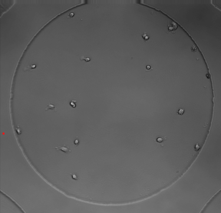
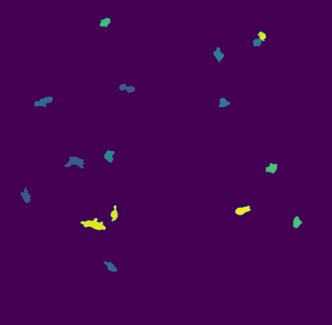
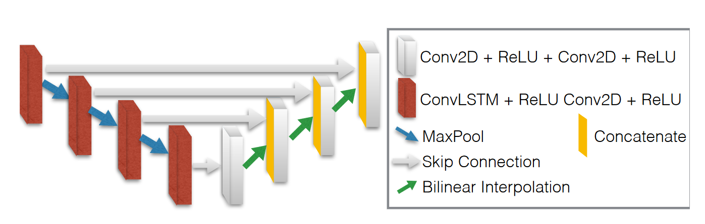
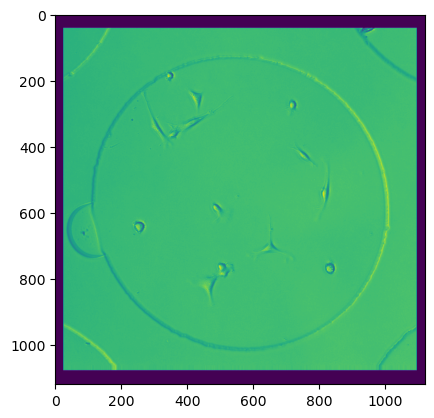
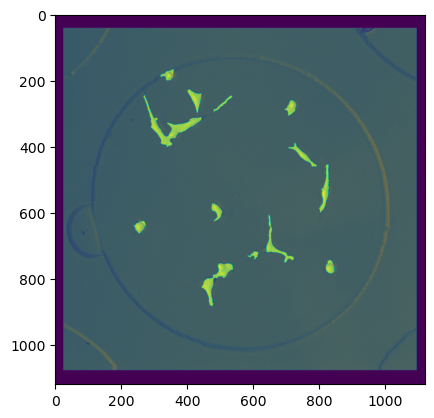
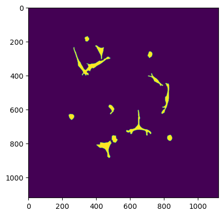

*This project was developed as an assignment for the machine learning in computer vision course at Masaryk University.*

# Cell segmentation from celltrackingchallenge.net
The task is to perform instance segmentation on a 2D+t dataset of mouse cells. The dataset contains 2,752 images. There are two tiers of annotations: silver and gold. Silver annotations exist for every image in the dataset, but are less precise (some can be computer-generated). Gold images are made by humans and should, therefore, be more precise, but there are way fewer of them. In this project, I used only silver annotations for simplicity.

[Mouse muscle stem cells in hydrogel microwells](http://celltrackingchallenge.net/2d-datasets/)

Example of one sample and silver annotation:

 

## Visualization of results

## Experiment 1
My first approach was to try the U-Net architecture because it is the baseline architecture for segmenting biomedical images. This approach is explored, for example, in [1]. At first, I made the network quite complex, and the training was not working correctly. Then I used an architecture more similar to the one proposed in [1]. I also used a similar approach to data augmentation - rotation and translation. I did not want to alter the intensity levels of the image in the augmentations because I was not sure what the characteristics of the microscope used are, and I could introduce something unnatural for this environment. It could also damage the structure of the cells. I also struggled with GPU memory - I had only 10GB of memory, and the architecture is quite memory-intensive. I solved this issue by resizing the image to only 256x256 with batch size 16. But this can cause problems since it drastically reduces the amount of information in the image.

[1] https://arxiv.org/pdf/1505.04597v1.pdf

## Experiment 2 
Then I tried a more complex architecture proposed in [2]. The main idea of the architecture is to use the time-domain information present in the dataset by using sequences as input to the model. At the start of every encoder layer, there is a convolutional LSTM layer. This layer uses LSTM cells which use results from the previous time steps to calculate the next time step. This type of layer is not part of the PyTorch library, so I used the implementation from [3]. But this architecture was even more demanding on GPU memory, so I struggled quite a bit with the training process. I had to do a lot of troubleshooting and spend a lot of time getting the model to train correctly.

My first approach was to use the same method as in experiment 1 - I reduced the image size to 160x160 and batch size to 3. Every sample from the batch consists of a sequence of 5 images (this was the number used in the original paper). Another important thing is that any random augmentation must be the same for the whole sequence (and masks). However, this approach had quite poor performance - I believe the reason is that there are many learnable parameters, and the image is resized too much.

[2] https://arxiv.org/pdf/1805.11247v2.pdf

[3] https://github.com/czifan/ConvLSTM.pytorch

## Experiment 3
For the last experiment, I tried to use the approach used by the authors of the original paper. Instead of resizing the image, I took random crops of size 160x160 as input. However, this did not work well, as the training was slow. I think the main reason for this is that many images contain a small number of cells, so there is a large chance for the random crop to be empty. I tried solving this issue by using the function "CropNonEmptyMaskIfExists" for random crop. However, I decided to reduce the chance of applying this operation to some lower percentage (70%) to introduce at least some empty (or border) segments of the image.

To evaluate this method after training, I sliced each image of the sequence into patches of size 160x160, passed them through the model, and connected them back together to get the full segmented image. This introduced some artifacts on the borders of the patches. It would be better to pass the whole images through the model.

### Improvement
When I was testing the trained model, I noticed that there were some small particles, and some cells were separated by thin lines. I think this is caused by the slicing. To solve this, I tried to use closing with a small disk element to reconnect the separated cells. Then I applied area opening to remove the small particles. This improved the results (reduced the number of false positives) on the training set, so I kept it for the final evaluation.

## Some more approaches
There are many more architectures that can be used for instance segmentation. For example, the authors of [4] propose a method that adds segmentation output to Faster R-CNN. The original method has two outputs - one for object class and one for bounding box. Mask R-CNN adds another output containing a pixel mask as segmentation. The usage of this model can be found, for example, in [5].

[4] https://arxiv.org/pdf/1703.06870.pdf

[5] https://arxiv.org/pdf/1703.06870.pdf

## Evaluation
For evaluation, I used the method described in the article [6]. For segmentation, I calculated the UoI score. For instance segmentation, I used the definitions from the article:
- *true positive* is observed when a prediction-target mask pair has an IoU score which exceeds some predefined threshold.
- *false positive* indicates a predicted object mask had no associated ground truth object mask.
- *false negative* indicates a ground truth object mask had no associated predicted object mask.

Then I calculated recall ($\frac{tp}{tp+fn}$) and precision ($\frac{tp}{tp+fp}$). These values were calculated for different IoU thresholds ranging from 0 to 1 to create a precision-recall curve.

The model from experiment 2 was evaluated only with IoU score since it has quite poor results. I did not spend as much time with this model (both development and training) as the others. I think the resolution was reduced too much.

Final scores (Precision and recall shown with IoU thresholds):
| Model | IoU | 0.25 Precision | 0.25 Recall | 0.5 Precision | 0.5 Recall | 0.75 Precision | 0.75 Recall  |
|--|--|--|--|--|--|--|--|
| Unet | 0.74 | 0.96 | 0.99 | 0.76 | 0.67 | 0.07 | 0.06 |
| LSTM Unet full frame | 0.54 |  | |  |  |  | |
| LSTM Unet crops | 0.73 | 0.94 | 0.93 | 0.81 | 0.73 | 0.52 | 0.47 |

The full Recall curve can be found in the notebooks (however, the sampling is quite small to save time). The results show that all models struggle with the IoU score, but recall and precision with a smaller threshold show that instance detection is not that bad. In the results in [7], this dataset has the best score in the SEG section around 0.78. The numbers can't be directly compared since the evaluation method (and data) is different, but we can see that this dataset is not as simple for segmentation as some other datasets.

We can see, that even if the IoU score of the LSTM unet is worse then basic unet, but recall and precision is way better for higher thresholds.

Example of input, image segmentation by the last model (overlayed on the input image), and silver truth segmentation:

  

[6] https://www.jeremyjordan.me/evaluating-image-segmentation-models/

[7] http://celltrackingchallenge.net/latest-csb-results/

## Some final thoughs and additional improvements
I learned a lot in this project. Next time I would spend more time on the basic architecture (Unet in this case) before moving to something more complex. I would also let the networks train longer. I often stopped the training to test some idea. I would also use a more powerful GPU if possible. I used a 3080 in my PC. I struggled a lot with memory problems, especially with the LSTM networks. I would also try to better understand the problem, find out what valid augmentations are, etc.

There are a number of improvements that could be implemented. For example, the instancing of the cells is now performed simply by the label function. A better approach is to use some operation to better separate touching cells. For example, watershed on a distance-transformed image can be used to find the borders. Even better could be to use a model that directly outputs instances.

